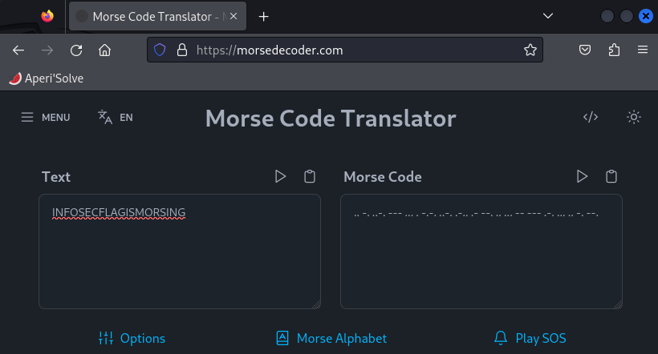

# Morse code

## Description

先看看維基百科Wikipedia的說明
https://en.wikipedia.org/wiki/Morse_code

你可以善用線上許多摩斯編碼
https://morsecode.scphillips.com/translator.html

來解解底下的題目吧

.. -. ..-. --- ... . -.-. ..-. .-.. .- --. .. ... -- --- .-. ... .. -. --.

## Solution

到 https://morsedecoder.com/ 解碼

> Flag: `INFOSECFLAGISMORSING`
