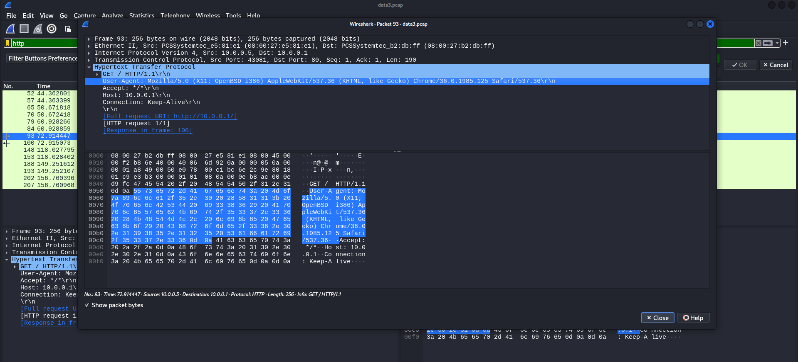

# NET3_Special Agent User

## Description

We can get into the Administrator's computer with a browser exploit.
But first, we need to figure out what browser they're using.
Perhaps this information is located in a network packet capture we took: data3.pcap.
Enter the browser and version as "BrowserName BrowserVersion".

NOTE: We're just looking for up to 3 levels of subversions for the browser version (ie. Version 1.2.3 for Version 1.2.3.4) and ignore any 0th subversions (ie. 1.2 for 1.2.0)

## Solution

用 wireshark 分析封包

發現發送的 HTTP 請求中，除了使用 Wget 外還有一包使用瀏覽器

題目的最後一句說要忽略兩位數版本號，因此忽略 mozilla 1.16 與 Safari 537.36，最終發現 Flag: Chrome 36.0.1985

> Flag: `Chrome 36.0.1985`
